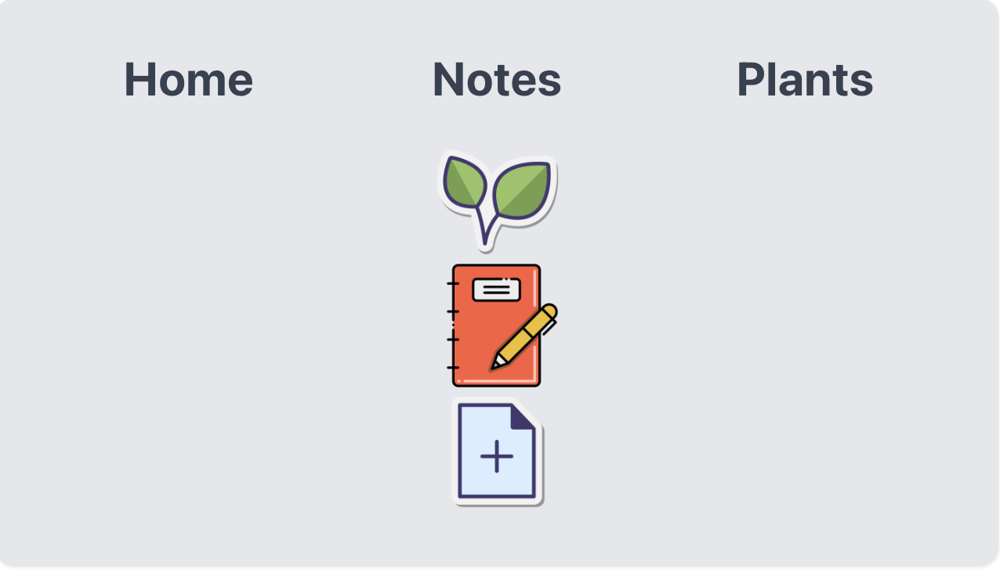
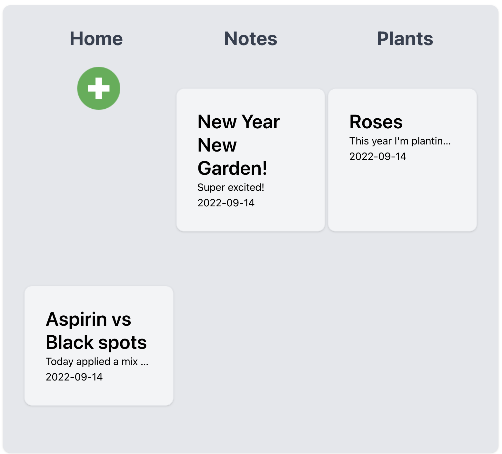

# Grow-It
---

## Date: 9/1/2022

---

### By: Jennifer Griffin

[GitHub](https://github.com/jengriffin) [LinkedIn](https://www.linkedin.com/in/jennifer-griffin-1223211b8/)

---

### **_Description_**

There are 2 universal truths about gardners: Every spring the smell of dirt and budding life gives them joy and the need to plant, and they are scattered brain. Each season, and planting year brings weekly if not daily challenges that require gardners to build a repository of homebrewed solutions. This app is a gardner's best friend. It allows gardners to not only keep track of what plants were planted and when, but allows the users to create a plant database and track personal notes on their plants progress through out the year. No more journals to lose, or faded garden stakes. Now you can make notes on the fly and always have them with you and organized.

---
### **_Screenshots_**

### **_Technologies Used_**

- JavaScript
- CSS
- HTML
- Python
- Djano
- React
- Postgres
- TailwindCSS

---

### **_Getting Started_**
Fork and Clone
npm i
npm start
#### ** A trello board was used to keep track of development progress and can be viewed [here](https://trello.com/b/oK7cl53p/grow-it).

---

### **_Credits_**

#### **Markdown Guide:[GitHub](https://github.com/jengriffin/u1_hw_markdown)**
**[Styling](https://medium.com/codingthesmartway-com-blog/how-to-use-tailwind-css-with-react-9dd78bbdc0e0)**
**[File upload](https://www.geeksforgeeks.org/file-uploading-in-react-js/)**
